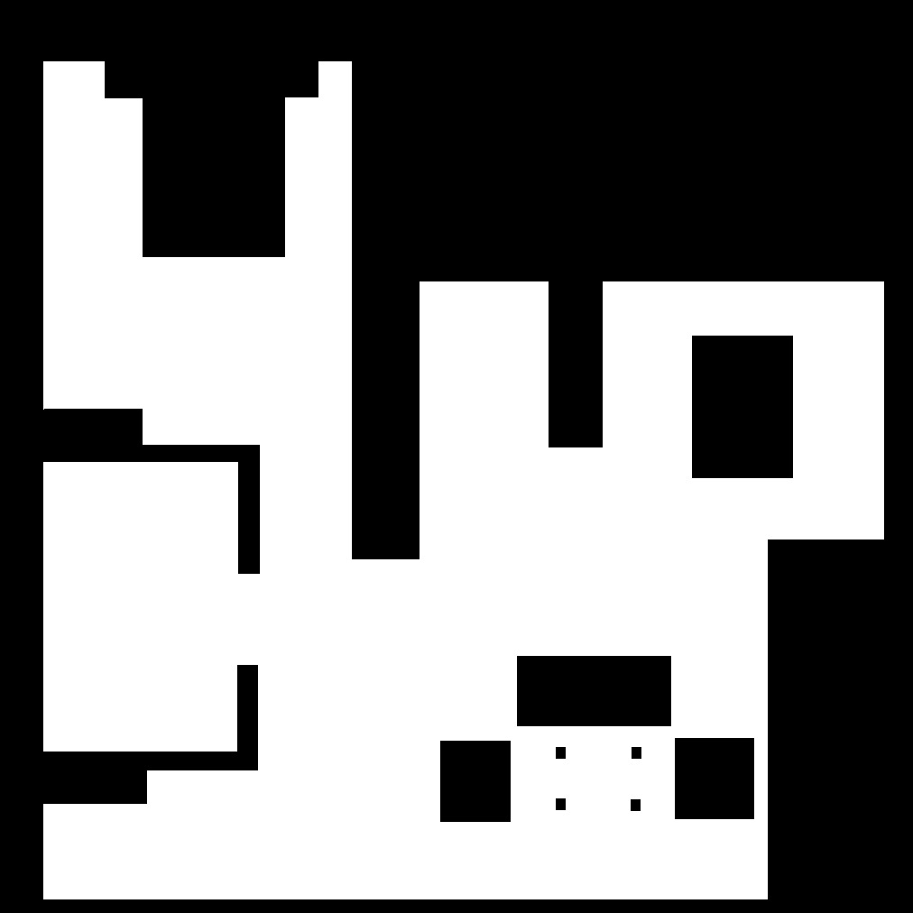
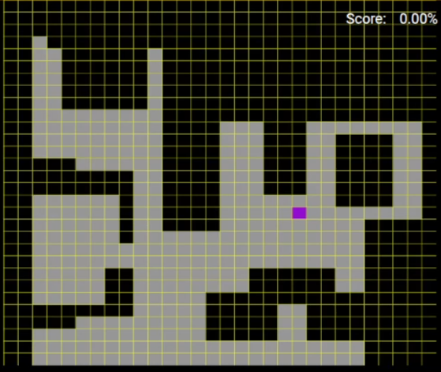
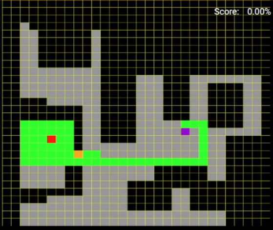
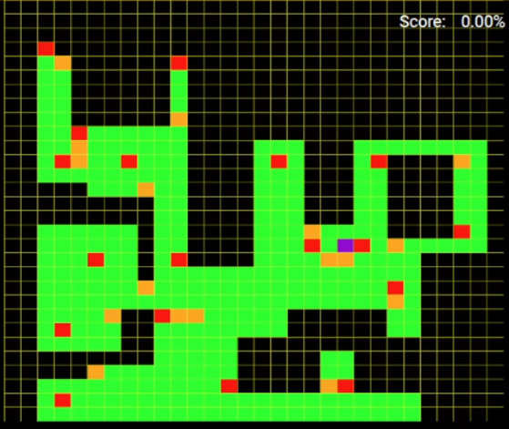
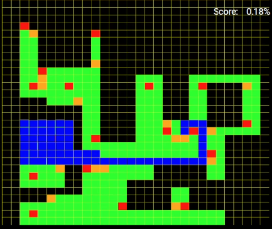
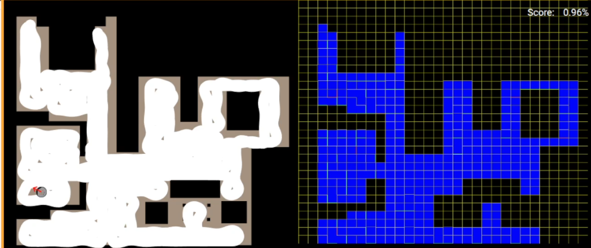

# P1 Localized Vacuum Cleaner

# Introducción

La práctica consiste en la creación de un algoritmo de cobertura, capaz de recorrer un mapa rejillado, usando la localización del propio robot.
El objetivo principal será cubrir la mayor superficie posible de una casa utilizando el algoritmo programado.

La aproximación a este problema se realizará mediante 4 partes:

1. **Registrar el mapa**: Este apartado consistirá en recoger coodenadar del mundo real y encontrar la matriz de transformación que traslade estos puntos a pixeles en un mapa (1012x1012).

2. **Crear las celdillas**: En este paso se crea el mapa con las rejillas y adicinalmente yo creo un mapa que guarda las relaciones entre el pixel central de la rejilla y sus coordenadas en el mundo. El mapa resultante esta coloreado en funcion de la ocupación del mapa original.

4. **Algoritmo BSA**: Este es el algoritmo principal del ejercicio. Es el encargado de generar rutas que abarquen toda las rejillas disponibles del mapa anteriormente mencionado. Además realiza internamente labores de regreso a puntos de retorno, cuando el algoritmo se encuentra en una zona crítica de exploración.

5. **Seguimiento de la ruta**: Teniendo en cuenta el ruido en los actuadores, el algoritmo de navegación se encarga de ejecurtar la ruta creada por el algoritmo BSA. En mi caso realizo un control de posición cuyo objetivo es el centro de la rejilla que aparece en la ruta a seguir.

<div align="center">
<p style = 'text-align:center;'>> </p>
</div>

# Experiencias y resultados

## Registrar el mapa

Para conseguir una matriz de transformación coherente, es necesario tomar la relación de minimo 4 puntos del mapa. En mi caso para que la operación fuera mas precisa, registré 8.

```python
pixel = np.array([
    [48, 68],
    [158, 454],
    [288, 494],
    [466, 618],
    [164, 888],
    [774, 728],
    [852, 596],
    [848, 994]
])

c_map = np.array([
    [5.305, -3.475, 1],
    [4.075, 0.33, 1],
    [2.885, 0.705, 1],
    [1.105, 1.923, 1],
    [4.165, 4.653, 1],
    [-1.595, 3.005, 1],
    [-2.701, 1.735, 1],
    [-2.701, 5.738, 1]
])
```

Estos son los puntos empleados para realizar la siguiente operación

**Fórmula empleada**

```python
M_affine = np.linalg.lstsq(c_map, pixel, rcond=None)[0]
```
linalg.solve(a, b) Resuelve una ecuación matricial lineal o un sistema de ecuaciones escalares lineales. Calcula la solución «exacta», x, de la ecuación matricial lineal bien determinada, es decir, de rango completo, ax = b.

El resultado es un matriz con la que podremos transformar los puntos de mundo a pixels y de pixels a mundo con la inversa.

*Ejemplo de la función Mundo a Pixel:*

```python
def world_to_pixel(x_wor, y_wor, m_wtp):
    """ Transform world coordinates into pixels

    Recive: World coordinates and world transformation matrix
    Return: Pixel of the coordinates
    """
    result = np.dot(m_wtp, np.array([x_wor, y_wor, 1]))
    return result[0], result[1]
```

<div align="center">
<p style = 'text-align:center;'></p>
</div>

## Crear las celdillas

Con la matriz del apartado anterior ahora podremos crear relaciones entre las coordenadas y los pixeles en la imagen. 
De esta forma he creado dos mapas:

- Mapa con las relaciones pixel/mundo: Matriz 2D en la que encontramos los pixeles centrales de todas las celdas como acceso por indice y su relación en el mundo como dato interno.

    |  Grid 0  | Centro Pixel X |
    |:---------|:---------|
    | Centro Pixel Y | world cords  |

- Mapa coloreado con rejillas: Este mapa lo he creado para poder mantener un orden visual y espacial de los obstaculos, zonas libre, zonas críticas...
Este mapa es usado para comprobar de forma rápida el estado de ocupación de la rejilla. 

    - <font color="red">**RED**</font> = 128     : Zona crítica  
    - <font color="orange">**ORANGE**</font> = 129  : Posición de retorno
    - <font color="yellow">**YELLOW**</font> = 130  : Bordes de las rejillas (Da una separación visual)
    - <font color="green">**GREEN**</font> = 131   : Zonas Visitadas
    - <font color="blue">**BLUE**</font> = 132    : Zonas Recorridas por el robot
    - <font color="VIOLET">**VIOLET**</font> = 134  : Zona donde inicia el Robot el recorrido
    - <font color="GREY">**FREE**</font> = 75     : Rejillas no ocupadas por obstaculos
    - <font color="BLACK">**OBSTACLE**</font> = 0  : Rejillas ocupadas por obstaculos

**Fórmula empleada**

```python
# Colour occupied and free cells
if (np.any(map_array[y0:y1, x0:x1] == 0)):
    colored_grid[y0:y1, x0:x1] = OBSTACLE
else:
    colored_grid[y0:y1, x0:x1] = FREE

# colour cell edges
colored_grid[y0:y1, x0:x0+1] = YELLOW
colored_grid[y0:y0+1 , x0:x1] = YELLOW
```

## Algoritmo BSA

El algoritmo debe recorrer todas las rejillas que se marcaron como <font color="GREY">**FREE**</font> en durante la creación de las rejillas. En mi caso opte por usar el mapa coloreado para guiar todo el proceso de creación de ruta. Sin duda la parte más dificil de la practica.

La exploración comienza desde la posición del robot, marcando esta casilla como ocupada. Después, se explora la casilla que está al norte, si está libre se añade a la ruta y si está ocupada se explora la casilla que le sigue en el **orden de exploración**. Todas las casillas visitadas queda marcadas en <font color="green">**GREEN**</font>.

El orden de exploración es:

```py
# Directions (N, E, S, O)
directions = [(-cell_size, 0), (0, cell_size), (cell_size, 0), (0, -cell_size)]
a, b = directions[dir_idx]
...
dir_idx = (dir_idx + 1) % 4
```

Si durante el recorrido el algoritmo detecta que se encuentra rodeado de casillas visitadas u obstaculos, se marca la casilla actual de <font color="red">**RED**</font> y se inicia la busqueda de una ruta hasta el punto seguro mas cercano marcandolo en <font color="orange">**ORANGE**</font>. Para esta busqueda se emplea un algoritmo **BFS**, que se encarga de encontrar el camino mas corto entre el punto crítico y el de retorno seguro.

**Fórmulas empleadas**

Calculo de la rejilla de retorno más cercana:
```py
# Euclidean distance
closest = min(save_points, key=lambda p: np.hypot(p[0]-current[0], p[1]-current[1]))
```

<div align="center">
<p style = 'text-align:center;'></p>
</div>

## **Seguimiento de la ruta**

Para poder seguir la ruta extraida por el algoritmo BSA, he empleado un controlador proporcional basado en la posición del robot. Durante la ejecución del bucle principal del código, exttraigo de uno en uno cada punto y calculo cual es la velocidad lineal y de giro que tengo que llevar para alcanzar el objetivo.

```py
# Get the coordinates
dx = x_goal - HAL.getPose3d().x
dy = y_goal - HAL.getPose3d().y
dist = math.hypot(dx, dy)
angle_to_goal = math.atan2(dy, dx)
angle_error = angle_to_goal - HAL.getPose3d().yaw
```

Durante el recorrido las casillas que ya han sido visitadas, quedan marcadas en <font color="blue">**BLUE**</font>.

<div align="center">
<p style = 'text-align:center;'></p>
</div>

Al finalizar la navegación, todas las rejillas habrán sído aspiradas exitosamente.

<div align="center">
<p style = 'text-align:center;'></p>
</div>

## Parametros empleados 

- Para el numero de rejillas:
```py
CELL_SCALE = 33
```
- Colores de las rejillas
``` py
RED = 128 
ORANGE = 129
YELLOW = 130
GREEN = 131 
BLUE = 132
INDIGO = 133
VIOLET = 134

FREE = 75
OBSTACLE = 0
```
- Parametros del control Proporcional:
```
# P Control
K_lin = 1
K_ang = 1.25
tol = 0.25
```

# Video del funcionamiento

Video del funcionamiento [^1]

[^1]: https://urjc-my.sharepoint.com/:v:/g/personal/e_martint_2022_alumnos_urjc_es/EUwcup48JTxOuhh_stQKvUwBWqdf-cUm9XjQ-RaA_08jlQ?nav=eyJyZWZlcnJhbEluZm8iOnsicmVmZXJyYWxBcHAiOiJPbmVEcml2ZUZvckJ1c2luZXNzIiwicmVmZXJyYWxBcHBQbGF0Zm9ybSI6IldlYiIsInJlZmVycmFsTW9kZSI6InZpZXciLCJyZWZlcnJhbFZpZXciOiJNeUZpbGVzTGlua0NvcHkifX0&e=98IcaD


# Observaciones

- En el apartado **Registrar el mapa** hay que tener especial cuidado con las matrices de transformación. Esto es un recordatorió para no usar la mastriz creada world-pixel como si fuera pixel-world.

- He empleado navegación por posición y un control P, ya que los espacios entre rejillas son muy pequeños y resulta más ventajoso de esta forma.

- Al teñir los bordes de cada rejilla de amarillo, se genera en ocasiones pequeñas distorsiones, esto se debe a que la transformación entre pixel y world no siempre es precisa y genera un pixel de error.


