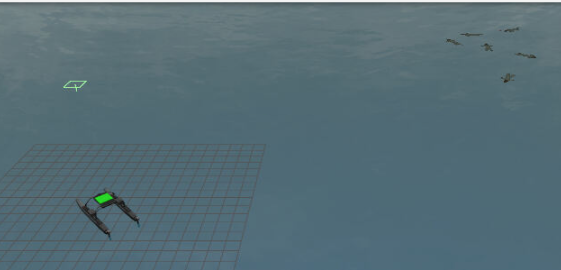
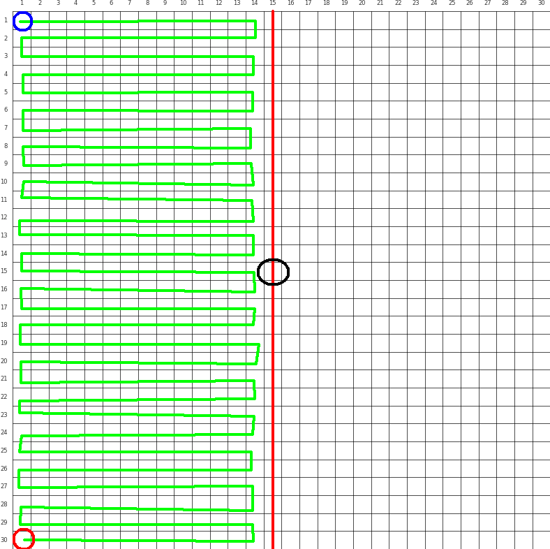
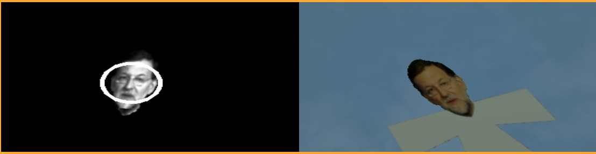
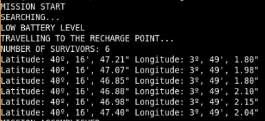

# P2 Rescue People

# Introducción

El objetivo de este ejercicio es implementar la lógica que permita a un cuadricóptero (Drone) reconocer los rostros de personas perdidas y guardar su ubicación para poder realizar posteriormente una maniobra de rescate.

La aproximación a este problema se realizará mediante un automata de estados finitos con los siguentes estados:

1) **TAKING_OFF** Primer estado: El drone despega y navega hasta la posición de referencía en la que se encuentran los supervivientes.

2) **SEARCHING** Segundo estado: El drone comienza la búsqueda recorriendo el lado izquierdo de un cuadrante 30x30.

3) **CHARGING** Tercer estado: El drone regresa a la base "simulando" que la batería necesita ser recargada.

4) **END** Último estado: Se muestran las coordenadas tomadas por el drone y se "finaliza" la operación. (Queda la segunda mitad del cuadrante)

<div align="center">
<p style = 'text-align:center;'> </p>
</div>


# Movimiento del drone

He decidido, comandar el drone por posición usando la función:

```python
HAL.set_cmd_pos(x_coor, y_coor, z_height, 0)
```

Esta llamada, permite al drone moverse libremente hasta la posición marcada en coordenadas del mundo. Como es una llamada no bloqueante, se debe comprobar si le drone ha llegado al destino. Por este motivo, he creado al función **navigate_towards** que se encarga tanto de navegar, como de recoger la posición de los supervivientes durante la trayectoría.

```python
# Fragmento de la función
def navigate_towards(x_coor, y_coor, z_height):
    world_dist = math.inf
    HAL.set_cmd_pos(x_coor, y_coor, z_height, 0)
    while world_dist > 0.1:
        world_dist = math.sqrt((x_coor - HAL.get_position()[0]) ** 2 + (y_coor - HAL.get_position()[1]) ** 2)
    #...
```

# Localización de los supervivientes

En este apartado explicaré como se ha implementado tanto el método de búsqueda como el método empleado para la detección de personas.

## Plan de búsqueda

Como expliqué anteriormente, el estado **SEARCHING** es el encargado de ejecutar el plan de búsqueda. Como se desconoce la localización de los supervivientes, he trazado una cuadrícual de 30x30 cuyo centro es la coordenada referente a los supervivientes.

El plan de búsqueda se basa en hacer un recorrido zig zag para tener mayor control de posición sobre el drone. La ruta se realiza sobre la mitad izquierda de la cuadrícula, para permitir que el drone regarse su batería tras la finalización de este cuatrante. 

En el caso de continuar con la búsqueda, el drone solo tendría que recorrer el cuadrante derecho restante.


<div align="center">
<p style = 'text-align:center;'> </p>
</div>


## Detección de personas

Para la detección se ha decidido utilizar la detección de rostros mediante cascadas Haar de OpenCV [^1], que se utiliza ampliamente para reconocer rostros humanos.

[^1]: https://docs.opencv.org/4.5.0/db/d28/tutorial_cascade_classifier.html

```python
FACE_CASCADE_NAME = "/resources/exercises/rescue_people/haarcascade_frontalface_default.xml"
```

Como la deteción de rostros con este metodo no es precisa, se ha decidico realizar las siguientes acciones para facilitar la localización:

- **Filtro de color HSV**: Este filtro elimina el color Azul de la imagen, permitiendo visualizar solo a las personas en la imagen. La función implementada es la siguiente.

```python
def filter_blue_hsv(image):
    low_range = (90,0,0)
    high_range = (150,255,255)

    img_hsv = cv.cvtColor(image, cv.COLOR_RGB2HSV)
    mask = cv.inRange(img_hsv, low_range, high_range) 

    res = cv.bitwise_and(image, image, mask = mask)
    return res
```
- **Rotaciones de 45º**: Como Haar no detecta bien los rostros que se encuentran torcidos al eje de la camara, antes de pasar la imagen al filtro se rota 45º hasta la detección de la persona. En caso de no encontrar nada, se determina que no hay persona en la imagen.

```python
    #...
    for angle in ROTATIONS:
        
        (height, width) = frame_gray.shape[:2]
        rotation_matrix = cv.getRotationMatrix2D((width // 2, height // 2), angle, 1.0)
        frame_gray = cv.warpAffine(frame_gray, rotation_matrix, (width, height))

        # Detect 
        faces = face_cascade.detectMultiScale(frame_gray, scaleFactor=1.1, minNeighbors=5, flags=cv.CASCADE_SCALE_IMAGE)
    #...
```
- **Imagen en escala de grises y ecualizado**: Esta parte es importante, ya que con estas operaciones, sobre la imagen a color, se consigue que Haar tenga mayor porcentaje de exito. Pasar a escala de grises permite al algoritmo trabajan analizando patrones de intensidad (brillo), bordes y contrastes en la imagen. El ecualizado permite mejorar el contraste, así la imagen pasa a ser mas nítida y mas fácil de manejar por el algoritmo Haar.

```python
    frame = filter_blue_hsv(image)
    frame_gray = cv.cvtColor(frame, cv.COLOR_BGR2GRAY)
    frame_gray = cv.equalizeHist(frame_gray)
```

### Resultado de la detección

Aquí podemos ver un ejemplo de como la imagen fue transformada y rotada

<div align="center">
<p style = 'text-align:center;'> </p>
</div>

# Clase Supervivientes

Esta clase me permite guardar las coordenadas de cada superviviente y poder usar metodos como getCoords(self) o proximity(self, coord) para determinar la cercanía entre supervivientes o las multiples detecciones de la mmisma persona durante el recorrido.

Esta estructura es útil ya que permite organizar y encapsular la información y las operaciones relacionadas con un superviviente (su posición, distancia a otros puntos, etc.) dentro de una única estructura. Así posteriormente se puede guardar en una lista y manejar los datos con mayor facilidad.

```py
class Survivor:
    def __init__(self, coords):
        self.coords = coords

    def getCoords(self):
        return self.coords
    #...
```

# Coordenadas de los supervivientes

Una vez tenemos las coordenadas de los supervivientes en Gacebo, tenemos que pasar a Grados, minutos y segundos, así el equipo de rescate puede navegar hasta la zona.

1) Como tenemos coordenadas Gacebo, lo primero es convertirlas a UTM.

2) A continuación, las coordenadas se transforma en Latitud y Longitud. Para ello se empleo la librería UMT que incluye la siguiente función:

```python
lat, lon = utm.to_latlon(easting, northing, zone, zone_letter)
```

3) Finalmente las distancias se transforman en Grados, minutos y segundos.

```py
def decimalToDms(valor):

    degrees = int(valor)
    minutes_dec = abs(valor - degrees) * 60
    minutes = int(minutes_dec)
    seconds = (minutes_dec - minutes) * 60

    return degrees, minutes, seconds
```


# Resultado final


<div align="center">
<p style = 'text-align:center;'> </p>
</div>


##
# Parametros empleados 

```python
# STATES
TAKING_OFF = 0
SEARCHING = 1
CHARGING = 2
END = 3

# Landed state
GROWNDED = 0
FLOATING = 3

# Distances
UP_DIST = 5.0
SEARCH_DIST = 2.5

# Search area
RADIO = 15

# UTM zone
UTM_ZONE = (30,'N')

ROTATIONS = [0, 45, 90, 135, 180, 225, 270, 315, 360]

# Just for survivors
PROXIMITY_THRESHOLD = 2.5
```

# Video del funcionamiento

Video del funcionamiento

https://urjc-my.sharepoint.com/:v:/g/personal/e_martint_2022_alumnos_urjc_es/EYOYufVcXIJOthMpfuwGEiEBhGO3Hw28Kc4zq_I1zusX7A?nav=eyJyZWZlcnJhbEluZm8iOnsicmVmZXJyYWxBcHAiOiJPbmVEcml2ZUZvckJ1c2luZXNzIiwicmVmZXJyYWxBcHBQbGF0Zm9ybSI6IldlYiIsInJlZmVycmFsTW9kZSI6InZpZXciLCJyZWZlcnJhbFZpZXciOiJNeUZpbGVzTGlua0NvcHkifX0&e=wUy2PL